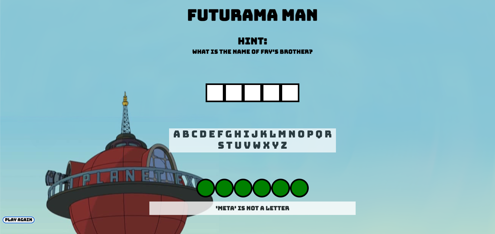
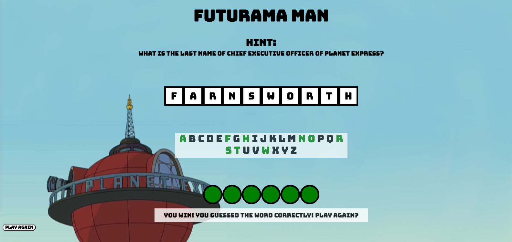
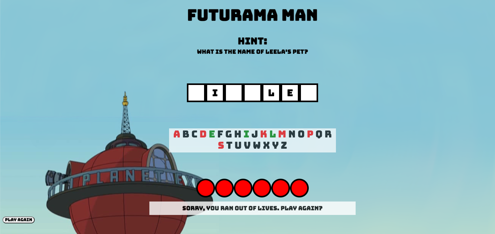

# **Futurama Man**

A simple Browser-based game. 'Futurama Man' is a play on the original Hangman game with a 'Futurama' theme. 

Hangman involves a player guessing a word (represented by a row of dashes) given a hint. The player will guess letter by letter, with correct a letter showing in the dashes, and an incorrect letter removing a life. If the player does not guess the word correctly within six guesses, the game is over and the player has lost. 

In this version, lives are represented by green circles, with a lost life represented by a red circle. The game can be played again with a new word to guess by pressing the "Play Again" button.

### **Screenshots**

### **Technologies Used**

* Javascript (Node.js)
* HTML
* CSS (Grid, Flexbox)
* Chrome DevTools
* Visual Studio Code

### **Getting Started**

https://sd3kim.github.io/futurama-man/

To start playing, press a key to make your guess. The game will register the key pressed and display if the letter is in the word (will display in the boxes and highlight the correct letter green) or not (will highlight the incorrect letter red and you will lose a life).

If you would like to play again or restart, press the "Play Again" button. 

### **Next Steps**

* Have lost lives represented by a hanged Bender figure (rather than circles to represent lives/lost lives).
* Make the game more responsive (for mobile play).
* Optimize code (make smaller, more readable functions).
* Make letters clickable to input letter guess.
* Include words in word bank that have more than one word.
    * Ex 1. Dr. Zoidberg
    * Ex 2. Planet Express
* Animation for when player wins or loses.
