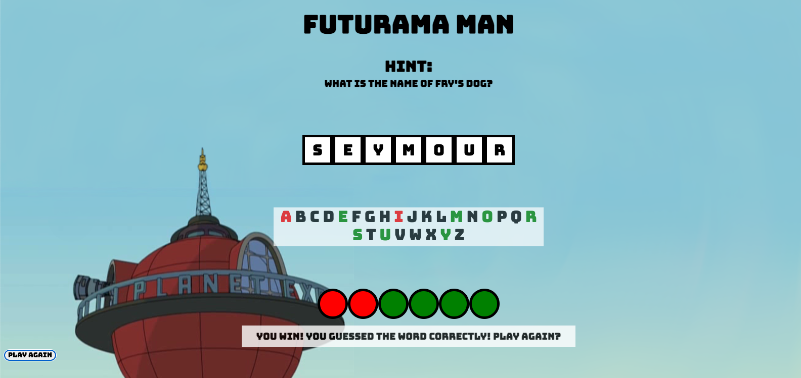

# Project-1

**Game-title**
Futurama-man -- a play on the original Hangman game with a 'Futurama' theme. 

Hangman involves a player guessing a word (represented by a row of dashes) given a hint. The player will guess letter by letter, with correct a letter showing in the dashes, and an incorrect letter removing a life. If the player does not guess the word correctly within six guesses, the game is over and the player has lost. 

In this version, lives are represented by green circles, with a lost life represented by a red circle. The game can be played again with a new word to guess by pressing the "Play Again" button.

**Screenshots**

**Technologies Used** 
Javascript (Node.js), HTML, CSS (Grid, Flexbox), Visual Studio Code

**Getting Started**

**Next Steps**

